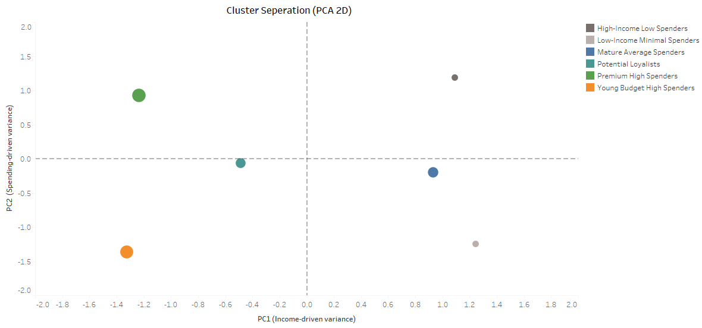

# 🛍️ Customer Segmentation using K-Means Clustering
### **By Vanshika Gupta**

---

## 🔍 Project Overview

This project focuses on **customer segmentation using K-Means clustering**, enhanced with **PCA (Principal Component Analysis)** for dimensionality reduction and **interactive Tableau dashboards** for business insights.

### The objective is to segment customers based on **demographics and spending behavior** to help businesses:
- Identify high-value customers
- Understand customer behavior patterns
- Enable targeted marketing and retention strategies

---

## 📂 Dataset Source

This project uses the publicly available Kaggle dataset:  
🔗 **Customer Segmentation Dataset**  
https://www.kaggle.com/datasets/vjchoudhary7/customer-segmentation-tutorial-in-python


### Dataset contains:
  - Customer demographics
  - Income levels
  - Spending behavior

---

## 🧠 Business Problem

Businesses often struggle to:
- Identify profitable customer groups
- Understand spending behavior vs income
- Design targeted marketing strategies

### This project solves that by:
- Grouping customers into meaningful segments
- Visualizing patterns through dashboards
- Providing actionable insights for decision-makers

---

## 🔧 Tools & Technologies
- Python (Pandas, NumPy, Scikit-learn, Matplotlib, Seaborn)
- K-Means Clustering
- PCA (Principal Component Analysis)
- Tableau Desktop / Tableau Reader

---

## 🔧 Methodology

### **Data Preparation**
- Cleaned and standardized customer data
- Selected relevant features:
  - Age
  - Annual Income
  - Spending Score

### **K-Means Clustering**
- Applied **Elbow Method** to determine optimal number of clusters
- Built **K-Means model** to segment customers
- Assigned cluster labels to customers

### **PCA (Principal Component Analysis)**
- Reduced multi-dimensional data to **2 principal components**
- Enabled clear **visual cluster separation**
- Improved interpretability and visualization

### **Visualization & Analysis**
- Built **interactive Tableau dashboards**
- Added filters, actions, and reset functionality
- Designed dashboards for both **overview and deep-dive analysis**

---

## 📊 Tableau Dashboard Highlights
- Customer Segmentation Overview
- Average Income & Spending by Segment
- Income vs Spending Analysis
- PCA-based Cluster Visualization
- Gender & Income Distribution by Segment
- Interactive filters and reset functionality

---

## 📊 Tableau Dashboard Preview

### **Customer Segmentation Overview**


### **Customer Behavior Deep Dive**


### **PCA Cluster Separation (2D)**


---

## 📌 Key Insights
- **Premium High Spenders** generate the highest revenue
- **Young Budget High Spenders** show strong engagement despite lower income
- **High income does not always high spending**
- **Potential Loyalists** represent strong upsell opportunities
- PCA confirms **well-separated clusters** validating the K-Means model

---

## 📝 Conclusion

This project demonstrates an end-to-end customer segmentation workflow combining:

- Machine Learning
- Dimensionality reduction
- Business intelligence dashboards

It highlights how data-driven insights can directly support strategic business decisions.

---

## 📈 How to Run the Project

### Python Analysis

Install dependencies:

```
pip install -r requirements.txt
```

## Open the Jupyter Notebook:

[Notebook/Customer Segmentation.ipynb](Notebook/Customer%20Segmentation.ipynb)

## Tableau Dashboard

Download the Tableau dashboard file:  
[Customer Segmentation Dashboard.twbx](Dashboard/Customer%20Segmentation%20Dashboard.twbx)

Open this file using **Tableau Desktop** or **Tableau Reader**.

---

## 📂 Folder Structure

```
Customer_Segmentation_KMeans/
│
├── Dashboard/
│ └── Customer Segmentation Analysis – K-Means Clustering.twbx
│
├── Data/
│ └── customer_segments.csv
│
├── Images/
│ ├── customer_segmentation_overview.png
│ ├── customer_behavior_deep_dive.png
│ └── pca_cluster_2d.png
│
├── Notebook/
│ └── Customer_Segmentation.ipynb
│
├── README.md
└── requirements.txt
```

👩‍💻 Author

Vanshika Gupta

Data Scientist | Machine Learning | Python | BI Developer
